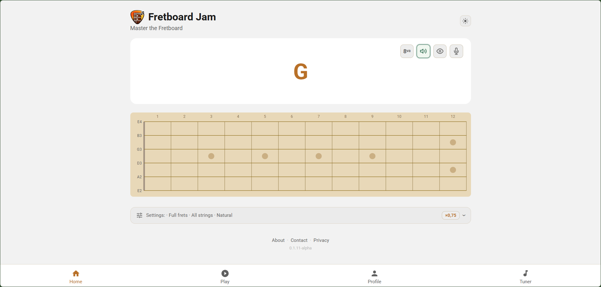
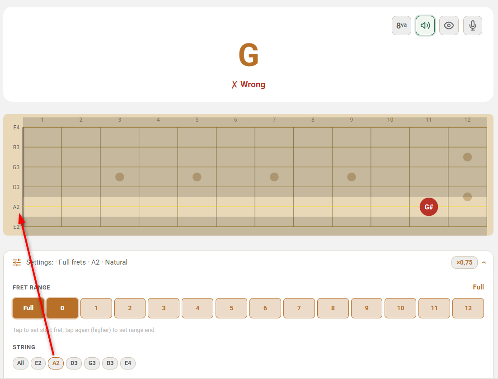
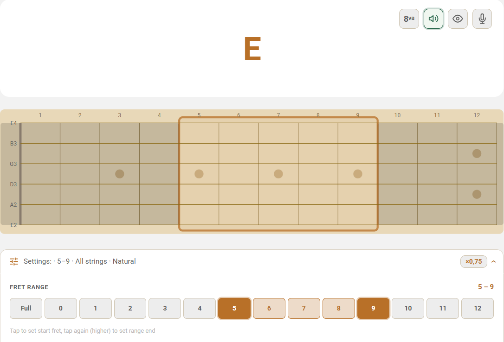
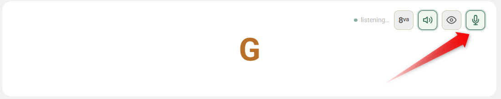
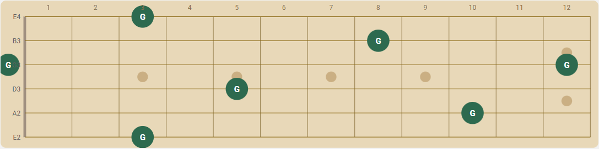

# Fretboard Jam 🎸

> **Learn the Notes on the Guitar Fretboard Through Active Playing — Not Just Visual Memorization.**
>
> [fretboardjam.com](https://fretboardjam.com)

<a href="https://buymeacoffee.com/alex_m" target="_blank"></a>


---



---

## Table of Contents

- [About](#about)
- [The Idea](#the-idea)
- [The App Interface](#the-app-interface)
- [App Modes](#app-modes)
  - [Basics](#-basics)
  - [Speed & Challenge](#-speed--challenge)
  - [Scales & Shapes](#-scales--shapes)
- [Practice Features](#practice-features)
  - [One String Mode](#one-string-mode)
  - [Fret Range](#fret-range)
  - [Mic / guitar Mode](#mic--real-guitar-mode-)
  - [Octave Mode](#octave-mode)
- [The Theory](#the-theory)
  - [Chromatic Scale](#the-chromatic-scale)
  - [Open Tuning](#standard-open-tuning-eadgbe)
  - [Fretboard Layout](#fretboard-layout)
  - [Fretboard Shortcuts](#fretboard-shortcuts)
- [Suggested Learning Path](#suggested-learning-path)
- [Share Feedback](#share-feedback)
- [Support the Project](#support-the-project)

---

## About

[Fretboard Jam](https://fretboardjam.com/) is a browser-based interactive guitar fretboard trainer. No download, no account, no install — open it in your browser and start playing.

The goal is simple: **know where every note is on the fretboard without thinking about it**. Fretboard Jam trains this through active, game-based exercises — not passive memorization charts.

This repository is the place to:
- 🐛 report bugs
- 💡 suggest new features or practice modes
- 🎸 share general feedback about the app

---

## The Idea

Most guitar learning resources show you *theory*. A chart of the fretboard. A scale diagram. A list of notes to memorize. That's fine — but it doesn't build the instant, automatic recognition you need when actually playing music.

**Fretboard Jam is built on one principle: Learning by Doing.**

You don't read about where C# is on the D string. You play it.

Plug in your guitar. The app listens via **audio input through your microphone** and detects your pitch in real time. Right note — next challenge fires immediately. Wrong note — try again. No tapping a diagram. No multiple choice. Your actual hands, on your actual strings.

Enable **acoustical feedback** and the app speaks each note name out loud — *"F sharp"*, *"C"*, *"A"* — so your eyes never leave the fretboard. The screen disappears. It starts feeling like someone calling out notes for you to find.

That loop — hear it, find it, play it, repeat — is exactly how **muscle memory** forms. Not from staring at a chart. From doing the thing, over and over, until your fingers move before your brain catches up. That's the whole point.

---

## The App Interface


The interface is intentionally minimal so you can focus on playing:

- **Prompt card** at the top — shows the current challenge (note name, fret position, ear training question)
- **Interactive fretboard** in the center — tap or click to answer
- **Score & streak counter** in the header — tracks your current session performance
- **Settings toolbar** below the fretboard — configure string lock, fret range, note filter and difficulty

### Action Buttons

| Button | What it does |
|--------|-------------|
| 🎤 **Mic** | Activate interactive guitar mode — play the answer on your instrument |
| 🔊 **Speak** | The app reads out note names aloud as you practice |
| 💡 **Solution** | Reveal the correct answer (available in select modes) |
| ⚙️ **Settings** | Quick access to fret range, string lock and note filter |

---

## App Modes

Fretboard Jam organizes its training into three clusters. Modes unlock progressively as you level up, so there is always a new challenge waiting.

---

### 🎸 Basics

#### 🎯 Note Hunt

*A note name flashes — find it on the fretboard*

A note name appears in the prompt card. Tap the correct fret on the correct string. The faster and more accurately you answer, the higher your streak bonus and XP. This is the **core training mode** and the best place to start.

**Available settings:** string lock (one string at a time), fret range, note filter (natural notes only or all 12), octave mode, mic input.

> 💡 **Tip:** Start with natural notes only (C D E F G A B). Unlock accidentals once you feel solid on the naturals.

---

#### 👂 Hear & Name *(Fret Flash)*

*A note plays — name it*

A fret position is shown and a note is played through your speakers. Pick the correct note name from the multiple-choice buttons. This mode trains your **ear alongside your fretboard knowledge** — both are essential for real playing. Tap the fret display at any time to hear the note again.

**Available settings:** octave-strict mode, note filter.

---

#### 🔗 Octave Connect

*Find the same note on every string*

A note name appears. You must tap the correct fret on **every string** — one string at a time, working from the low E down to the high e. Each string lights up as you complete it. This mode builds a deep, holistic understanding of how the same note repeats across the neck at different octaves.

Mic mode is fully supported: play each position on your guitar and the app detects pitch automatically.

---

### ⚡ Speed & Challenge

#### 🏃 Speed Run

*Maximum correct notes in 60 seconds*

The clock counts down from 60. Note prompts fire as fast as you can answer them. No time to think — just raw speed and accuracy. Your score at the end is your benchmark to beat in the next session.

**Available settings:** string lock, fret range, accidentals, mic input.

> 💡 **Tip:** Run Speed Run once a week under the same settings. Watching your score grow over time is one of the most satisfying measures of real progress.

---

#### ⚡ Triad Speed Challenge *(Coming Soon)*

*Find root, 3rd and 5th of triads against the clock*

Race the clock to locate all three notes of a triad across the fretboard. Major, minor, diminished and augmented triad types cycle each round. 60 seconds — how many complete triads can you find?

---

#### 📦 Pentatonic Speed *(Coming Soon)*

*Complete pentatonic box shapes against the clock*

A pentatonic box position and key appear on screen. Tap all notes in the shape before the timer runs out. All 5 box positions, all 12 keys, both major and minor pentatonic.

---

### 📦 Scales & Shapes

#### 🔻 Triad Practice *(Coming Soon)*

*Learn triads across the fretboard at your own pace*

A root note and triad type are given (major, minor, diminished, augmented, sus2, sus4). Tap the root, 3rd and 5th anywhere on the fretboard — no timer, just understanding. Every triad type, every root note, every position on the neck.

---

#### 🎵 Pentatonic Practice *(Coming Soon)*

*See and tap all 5 pentatonic box positions*

The root note and box region are highlighted on the fretboard. Tap every pentatonic note within that shape. All 5 boxes, all 12 keys, minor and major pentatonic — the most practical scales for rock, blues and improvisation.

---

#### 🎼 Scale Practice *(Coming Soon)*

*Construct scales across the full neck*

Given a root and scale type (major, natural minor, pentatonic major, pentatonic minor), tap every scale note on the full fretboard — not just one box position. The most complete form of fretboard scale training.

---

## Practice Features

### One String Mode



Lock practice to a single string. Ideal for **beginners** who want to master one string thoroughly before tackling the full neck. Available in Note Hunt and Speed Run.

**Recommended order to work through the strings:**

```
Low E → A → D → G → B → High e
```

---

### Fret Range



Restrict practice to a specific section of the neck. For example:

| Zone | Fret Range | Why practice here |
|------|-----------|------------------|
| Open position | 0 – 5 | Most common beginner and cowboy chord territory |
| Middle neck | 5 – 9 | Blues and solo territory |
| Upper neck | 7 – 12 | Lead playing and full-neck awareness |

Master each region in isolation before combining them into full-neck practice.

---

### Interactive Mic / guitar Mode 🎤



Connect your guitar (via an audio interface, or directly on devices that support it), tap the microphone button, and **play the answer on your guitar**. The app detects pitch through your browser's built-in microphone API — no plugin or download required.

This is the most powerful practice mode because it bridges fretboard knowledge directly into actual playing on your instrument.

> **Compatible instruments:** electric guitar with audio interface, acoustic guitar, nylon string guitar.  
> **Supported browsers:** Chrome, Edge, Safari 15+, Firefox.

---

### Octave Mode

Enable octave-strict mode to distinguish between E2 (open low E string) and E4 (first fret on high e). Useful for advanced players who want to train exact absolute note positions rather than note names alone.

---

## The Theory

Understanding the theory behind the fretboard makes the training click faster.

### The Chromatic Scale

The guitar uses the 12-note chromatic scale. Starting from any note and moving up one fret at a time (one fret = one half-step):

```
A  A#  B  C  C#  D  D#  E  F  F#  G  G#  → (back to A, one octave up)
```

Every fret adds one half-step. After **12 frets** you return to the same note name, one octave higher.

---

### Standard Open Tuning (EADGBE)

The six open strings in standard tuning, from thickest (lowest pitch) to thinnest (highest pitch):

```
String 6  (Low E)  →  E
String 5           →  A
String 4           →  D
String 3           →  G
String 2           →  B
String 1  (High e) →  e
```

The open string note is your anchor for every other note on that string. Memorize these six and you have a starting point on every string.

---

### Fretboard Layout

The inlay dots on the fretboard (frets 3, 5, 7, 9 and double dot at 12) are your visual landmarks.

Here is where **G** appears on every string in standard tuning:

| String | Open note | Fret for G |
|--------|-----------|-----------|
| 6  Low E | E | 3rd fret |
| 5  A     | A | 10th fret |
| 4  D     | D | 5th fret |
| 3  G     | G | open string |
| 2  B     | B | 8th fret |
| 1  High e | e | 3rd fret |



---

### Fretboard Shortcuts

Once you know a note on one string, you can find the **same note one octave higher** using these consistent patterns:

| Shortcut | From string | To string | Move |
|-------------|-----------|------|
| #1 | 6 → 4 | +2 strings | +2 frets |
| #2 | 4 → 2 | +2 strings | +3 frets |
| #3 | 5 → 3 | +2 strings | +2 frets |
| #4 | 3 → 1 | +2 strings | +3 frets *(B–G offset)* |
| #5 | Any → same fret +12 | same string | same note, one octave up |

These patterns mean you only need to **memorize notes on two strings** to navigate the entire neck. Learn the E and A strings completely — everything else follows from there.

---

## Share Feedback

Please open an issue and include as much detail as possible:

- what you expected to happen
- what happened instead
- steps to reproduce the issue
- screenshots or screen recordings if helpful
- device, browser and OS (e.g. Chrome 124 on Android 14)

[**→ Open a new issue**](../../issues/new)

---

## Support the Project

Fretboard Jam is free. If it is helping you learn the fretboard, please consider supporting development:

<a href="https://buymeacoffee.com/alex_m" target="_blank"></a>

Your support helps keep the project improving and allows more time to be dedicated to new modes, features and improvements.

---

*[fretboardjam.com](https://fretboardjam.com) · Free · No account required · No install · Works in any modern browser*